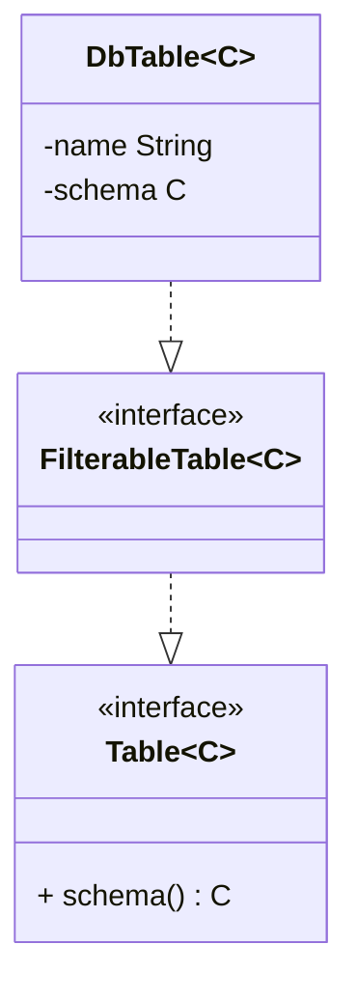
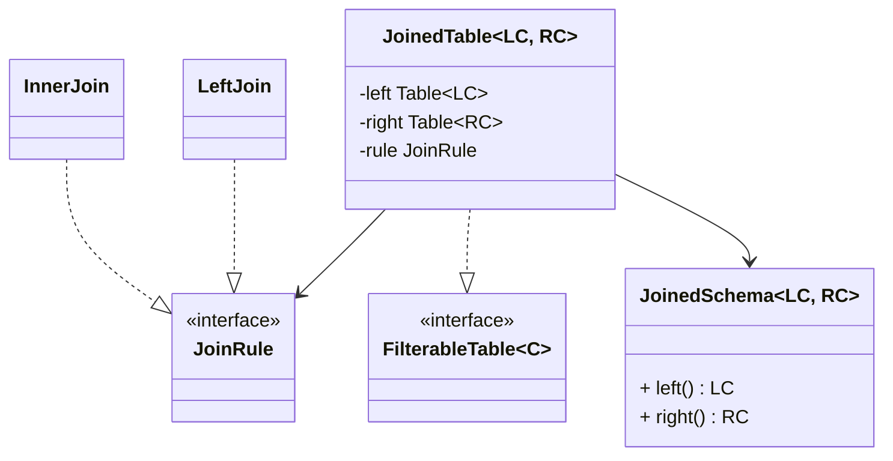
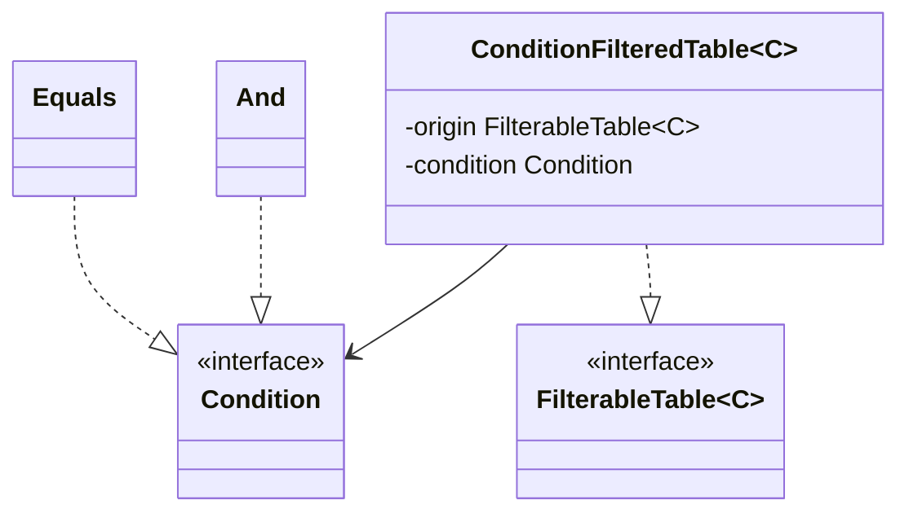
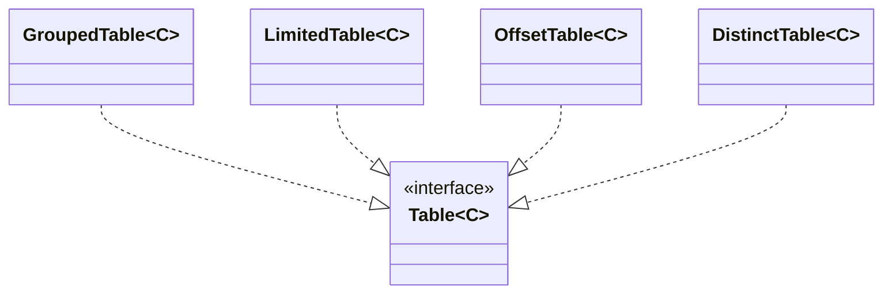
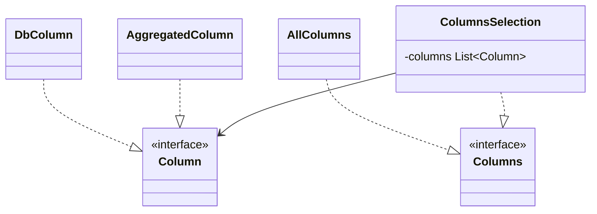
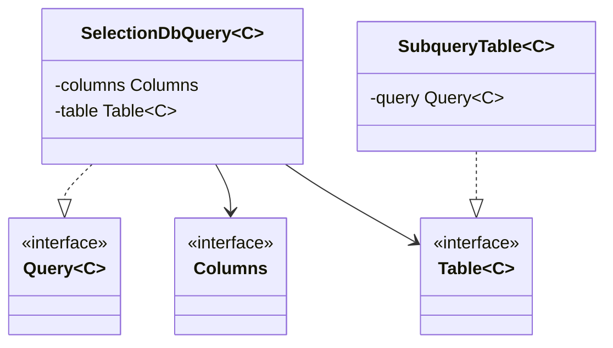

# Пример запроса кода
## Схема данных

<!-- Это компросисс на который прошлось пойти ради статической типизации. -->
```java
class UsersSchema {
    final Column id = new DbColumn("id");
    final Column username = new DbColumn("username");
    final Column status = new DbColumn("status");
}

class OrdersSchema {
    final Column userId = new DbColumn("user_id");
    final Column amount = new DbColumn("amount");
}
```

```java
Table<UsersSchema>  users  = new DbTable<>("users",  new UsersSchema());
Table<OrdersSchema> orders = new DbTable<>("orders", new OrdersSchema());

Table<JoinedScema<UsersSchema, OrdersSchema>> joined = new JoinedTable<>(
    users,
    orders,
    new InnerJoin(users.schema().id, orders.schema().userId)
);

Table<JoinedScema<UsersSchema, OrdersSchema>> filtered = new ConditionFiltedTable<>(
    joined,
    new Equals(joined.schema().left().status, new Literal("active"))
);

Table<JoinedScema<UsersSchema, OrdersSchema>> limited = new LimitedTable<>(filtered, 10);

Query<?> query = new SelectionDbQuery<>(
    new ColumnsSelection(
        joined.schema().left().id,
        joined.schema().left().username,
        joined.schema().right().amount
    ),
    limited
);
```

## Итоговый SQL
```sql
SELECT users.id, users.username, orders.amount
FROM users
JOIN orders ON users.id = orders.user_id
WHERE users.status = 'active'
LIMIT 10
```
