# Доменная модель

## Иерархия основных таблиц

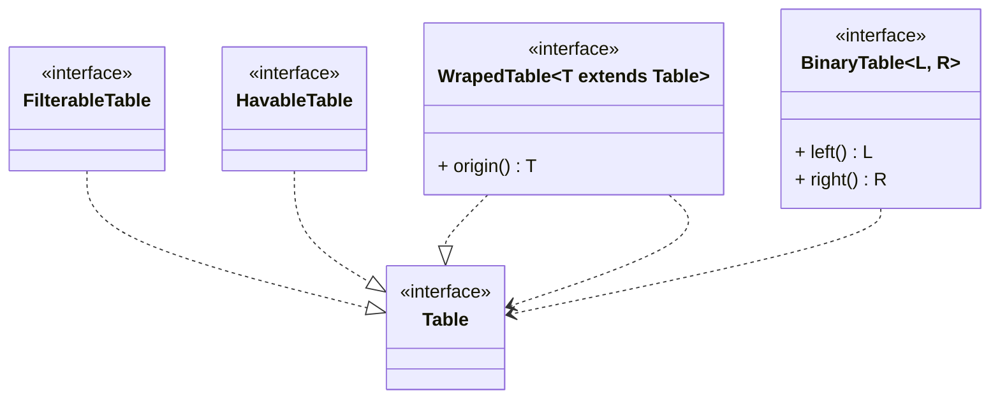

## Соединение таблиц

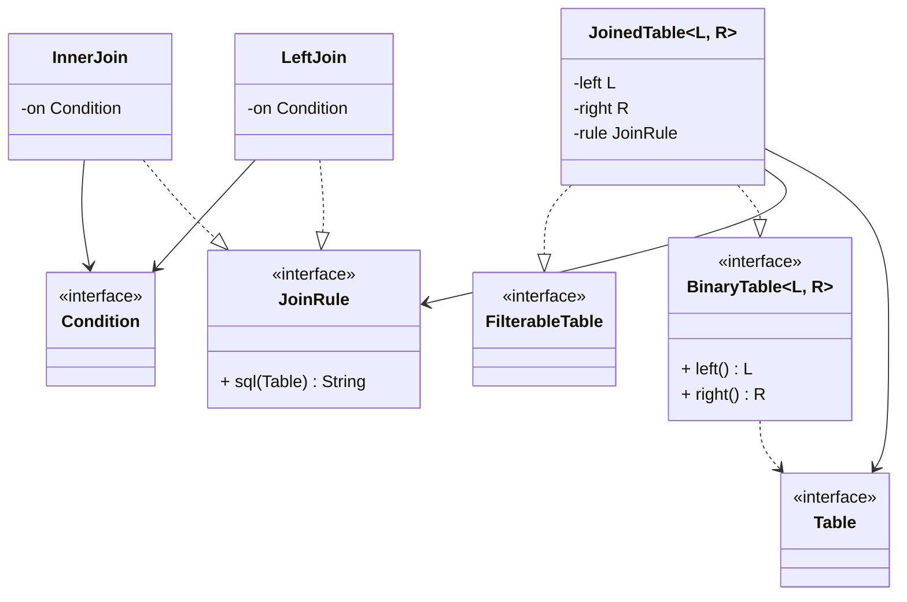

## Фильтрация и подзапросы

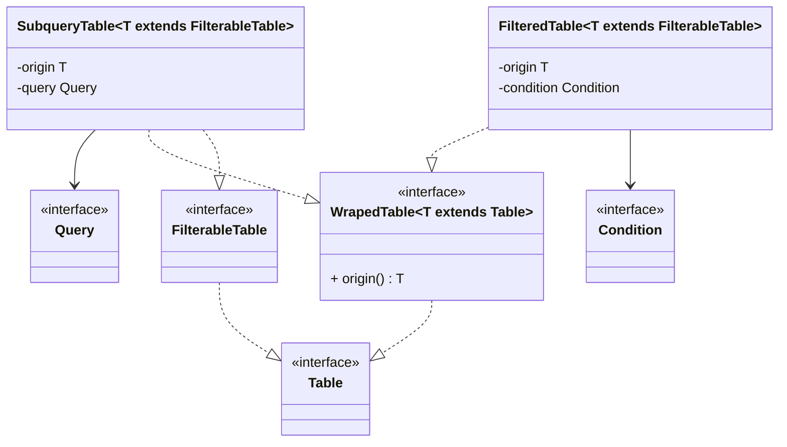

## Группировка

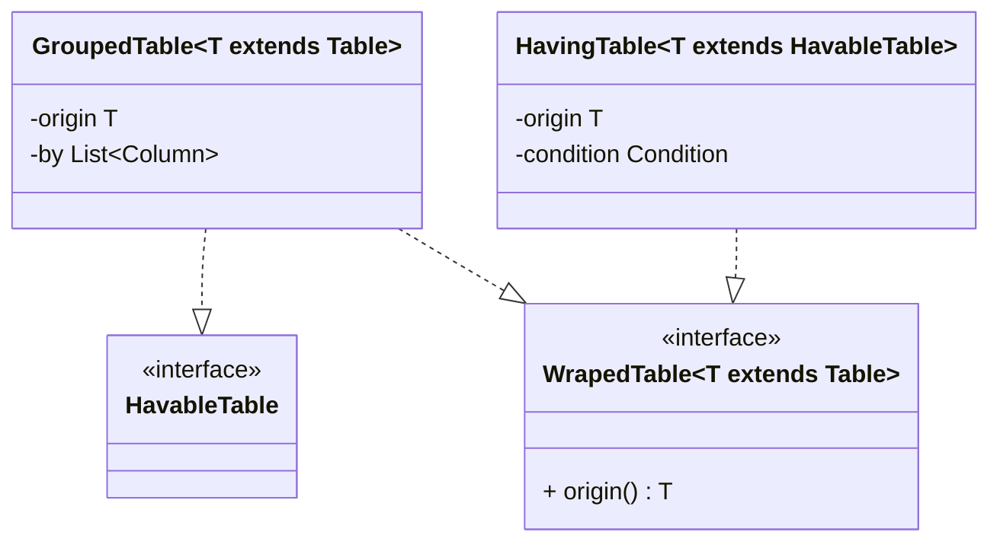

## Модификаторы

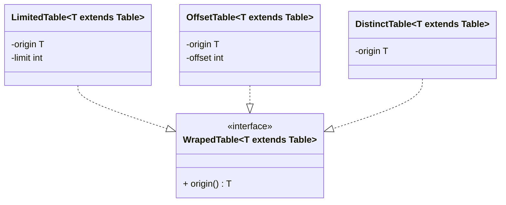

## Колонки и их выборка

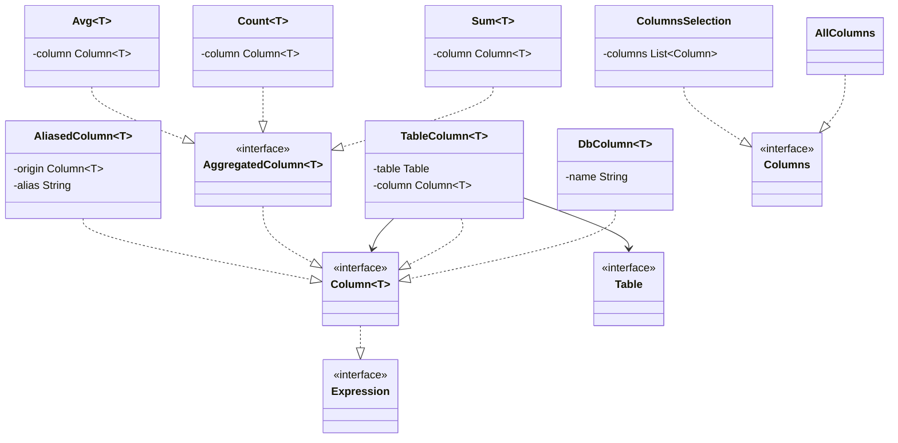

## Рендеринг в SQL

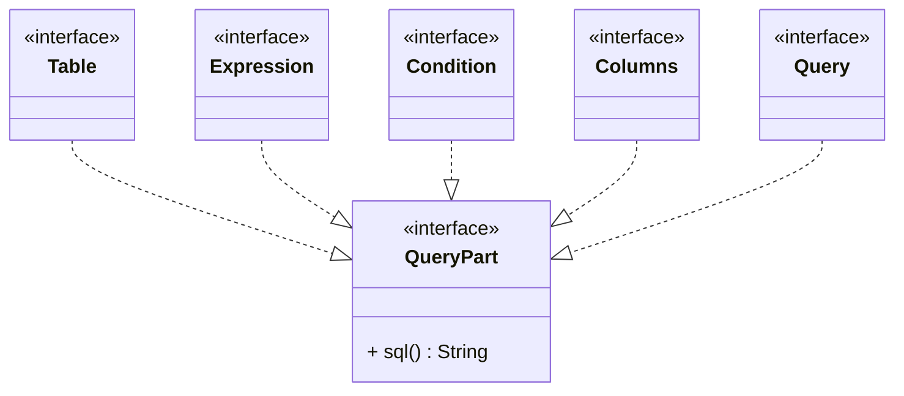

## Выражения

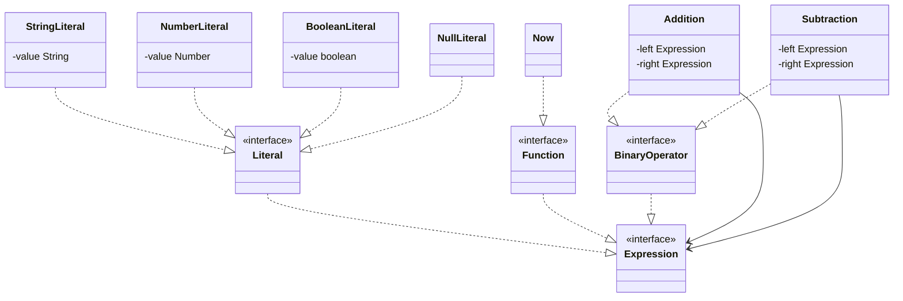

## Структура запроса SELECT

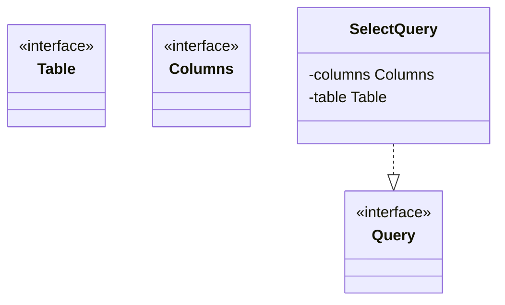

## Структура запроса INSERT

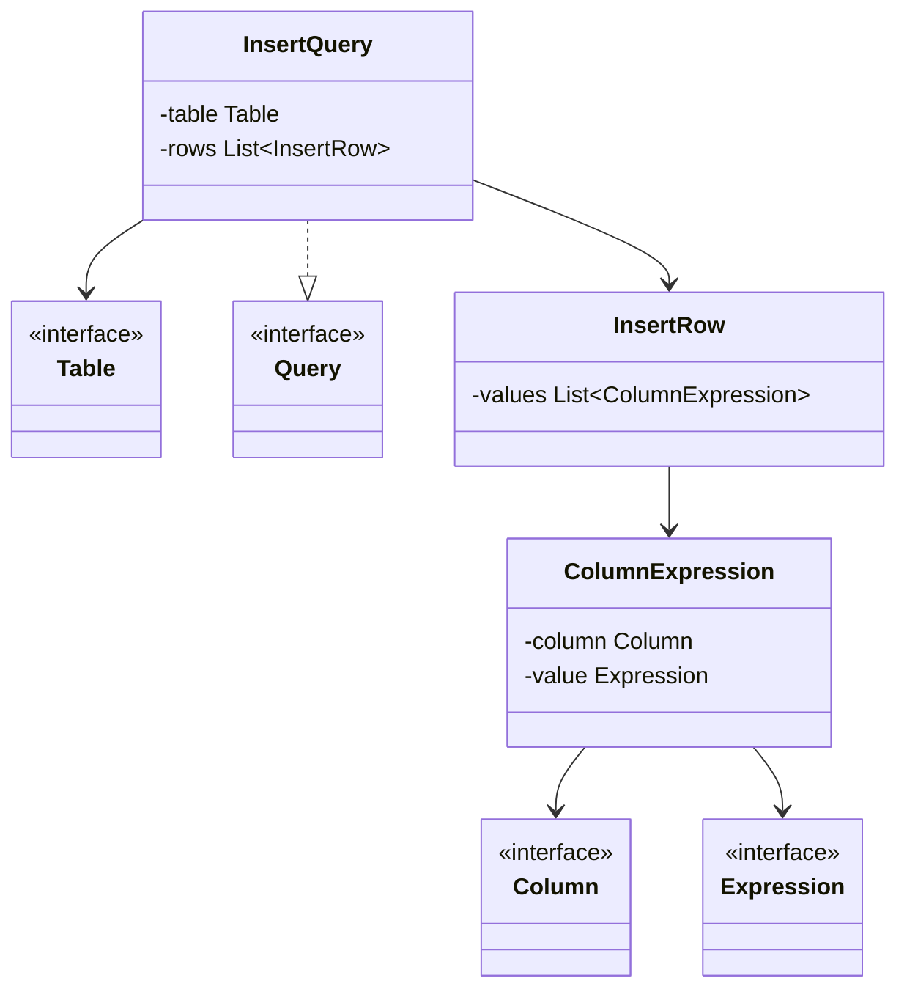

## Структура запроса UPDATE

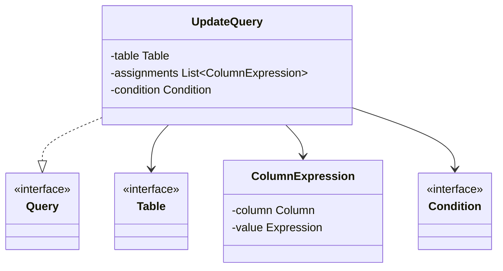

## Структура запроса DELETE

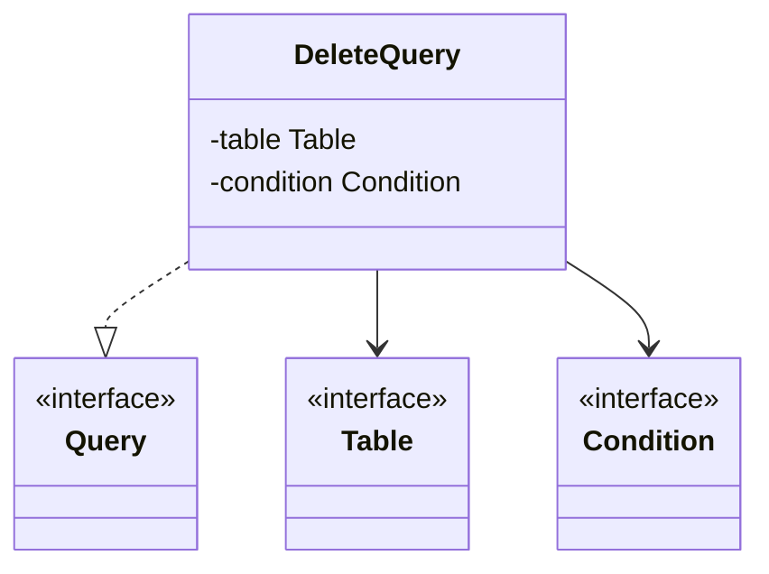

## Выполнение запроса и интерпретация результата

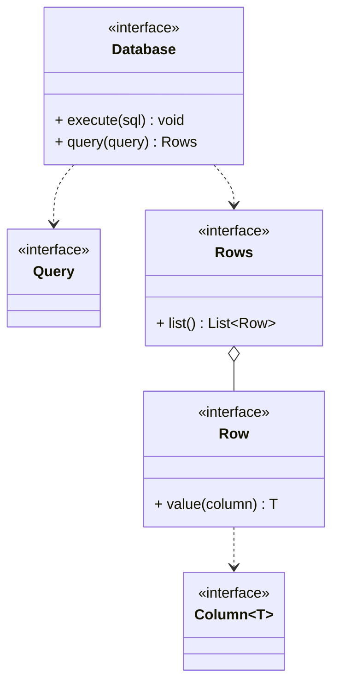
